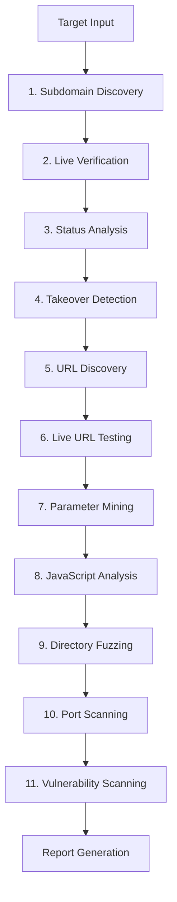
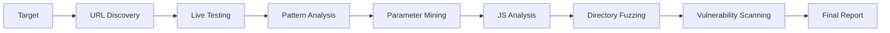
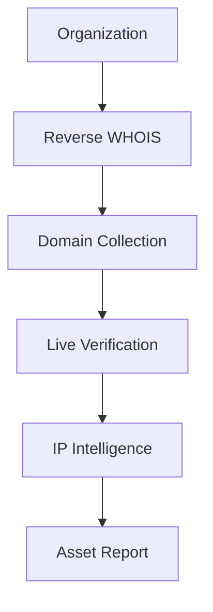

<div align="center">

# 🔍 HuntTheBug

[](https://opensource.org/licenses/GPL-3.0)
[](https://www.kali.org/)
[](https://www.zsh.org/)
[](https://bugcrowd.com/)
[](https://github.com/vikrantbatra05/HuntTheBug)
[](https://github.com/vikrantbatra05/HuntTheBug)
[](https://github.com/vikrantbatra05/HuntTheBug/issues)

---

# 🚀 Advanced Reconnaissance Framework for Bug Bounty Hunters

<p align="center">
  <a href="#-features">Features</a> •
  <a href="#-installation">Installation</a> •
  <a href="#-usage-guide">Usage</a> •
  <a href="#-workflow">Workflow</a> •
  <a href="#-contributing">Contributing</a>
</p>

---

## 📖 About

HuntTheBug is a **comprehensive, automated reconnaissance toolkit** designed specifically for bug bounty hunters and security researchers. It combines **30+ industry-leading tools** into a unified workflow for efficient vulnerability discovery.

<table align="center">
  <tr>
    <td align="center" width="150">
      <strong>🎯 Purpose</strong>
    </td>
    <td>
      Automated reconnaissance for bug bounty programs
    </td>
  </tr>
  <tr>
    <td align="center">
      <strong>🛠️ Tools</strong>
    </td>
    <td>
      30+ integrated security tools
    </td>
  </tr>
  <tr>
    <td align="center">
      <strong>⚡ Speed</strong>
    </td>
    <td>
      Parallel execution for maximum efficiency
    </td>
  </tr>
  <tr>
    <td align="center">
      <strong>📱 Notifications</strong>
    </td>
    <td>
      Real-time Telegram bot alerts
    </td>
  </tr>
</table>

---

## 🎯 Features

<table align="center">
  <tr>
    <td width="50%">
      
### 🔓 Subdomain Enumeration
<div align="center">

```diff
+ Multi-Source Discovery
+ Live Domain Verification  
+ Status Code Analysis
```

</div>

**🔧 Tools**: Amass, SubFinder, Sublist3r, Crobat, AssetFinder, FindDomain, GitHub, Subscraper, HTTPX, Httprobe, Hakcheckurl

    </td>
    <td width="50%">
      
### 🎭 Subdomain Takeover
<div align="center">

```diff
+ Automated Scanning
+ Real-time Alerts
+ Vulnerability Detection
```

</div>

**🔧 Tools**: SubJack, Nuclei, Telegram Bot

    </td>
  </tr>
  <tr>
    <td width="50%">
      
### 🌐 URL & JavaScript Analysis
<div align="center">

```diff
+ Historical URL Discovery
+ Live URL Verification
+ Parameter Extraction
+ JavaScript Mining
```

</div>

**🔧 Tools**: GAU, WaybackURLs, FFUF, ParamSpider, SecretFinder, JSFinder

    </td>
    <td width="50%">
      
### 📁 Directory & Port Scanning
<div align="center">

```diff
+ Advanced Fuzzing
+ Port Discovery
+ Vulnerability Assessment
```

</div>

**🔧 Tools**: Dirsearch, Naabu, Nuclei, Custom Wordlists

    </td>
  </tr>
  <tr>
    <td width="100%" colspan="2">
      
### 🏢 Organization Intelligence
<div align="center">

```diff
+ Reverse WHOIS Lookup
+ Corporate Asset Mapping
+ IP Intelligence
+ Infrastructure Analysis
```

</div>

**🔧 Tools**: Knockknock, HTTPX, IPinfo

    </td>
  </tr>
</table>

---

## 🏆 Key Advantages

<div align="center">

| 🚀 **Speed** | 🎯 **Accuracy** | 🛡️ **Security** | 📱 **Automation** |
|-------------|----------------|----------------|-------------------|
| Parallel execution | Multi-tool validation | Safe scanning practices | Real-time notifications |
| Optimized workflows | Comprehensive coverage | Non-intrusive methods | Scheduled scans |
| Smart caching | False positive reduction | Ethical guidelines | Custom alerting |

</div>

---

## 🛠️ Installation

### 📋 System Requirements
<div align="center">

| Requirement | Minimum | Recommended |
|-------------|---------|-------------|
| **💻 OS** | Kali Linux | Kali Linux Latest |
| **🔧 CPU** | 2+ Cores | 4+ Cores |
| **💾 RAM** | 4GB+ | 8GB+ |
| **💿 Storage** | 10GB+ | 20GB+ |

</div>

> ⚠️ **Warning**: Tested with 1GB RAM + 1 Core CPU resulted in system crashes. Ensure minimum requirements.

### 🚀 Quick Install

<div align="center">

```bash
# ┌─────────────────────────────────────┐
# │        Step 1: Install Deps        │
# └─────────────────────────────────────┘
apt install zsh git -y

# ┌─────────────────────────────────────┐
# │      Step 2: Clone Repository       │
# └─────────────────────────────────────┘
cd ~
git clone https://github.com/vikrantbatra05/HuntTheBug

# ┌─────────────────────────────────────┐
# │      Step 3: Setup Permissions      │
# └─────────────────────────────────────┘
cd ~/HuntTheBug
chmod +x *.zsh

# ┌─────────────────────────────────────┐
# │      Step 4: Run Installer          │
# └─────────────────────────────────────┘
./install.zsh
```

</div>

---

## ⚙️ Configuration

### 🔧 Advanced Setup

<div align="center">

#### 📊 Amass Configuration
```bash
nano ~/HuntTheBug/config/amass-config.ini
```
📖 [Detailed Guide](https://medium.com/@tucuong97/guide-to-amass-how-to-use-amass-more-effectively-for-analyst-domain-a6c430046946)

#### 🔍 SubFinder Configuration  
```bash
nano ~/HuntTheBug/config/subfinder-config.yaml
```
📖 [Setup Tutorial](https://dhiyaneshgeek.github.io/bug/bounty/2020/02/06/recon-with-me/)

#### 📱 Telegram Bot Setup
```bash
nano ~/HuntTheBug/conf.zsh
```

**Resources:**
- 🤖 [Bot Token & Chat ID](https://stackoverflow.com/questions/32423837/telegram-bot-how-to-get-a-group-chat-id)
- 🔐 [Alternative Method](https://sean-bradley.medium.com/get-telegram-chat-id-80b575520659)
- 📝 [GitHub Token](https://docs.github.com/en/authentication/keeping-your-account-and-data-secure/creating-a-personal-access-token)

</div>

---

## 🎮 Usage Guide

### 🎯 Choose Your Mission

<div align="center">

| 🌐 Medium Scope | 🎯 Small Scope | 🏢 Organization | 🔓 403 Bypass |
|-------------------|-------------------|-------------------|-------------------|
| `*.target.com` | `app.target.com` | `company_name` | `https://target.com` |
| Comprehensive recon | Focused analysis | Asset discovery | Access testing |

</div>

### 🚀 Launch Commands

<div align="center">

#### 🌐 Medium Scope Programs
```bash
./recon.zsh target.com
```
<details>
<summary>📋 What this does:</summary>

- 🔍 Subdomain enumeration (8+ sources)
- ✅ Live domain verification
- 🎭 Subdomain takeover detection
- 🌐 URL discovery & analysis
- 📁 Directory fuzzing
- 🔌 Port scanning
- 🛡️ Vulnerability assessment

</details>

#### 🎯 Small Scope Programs
```bash
./dom_hunt.zsh app.target.com
./dom_hunt.zsh target.com
```
<details>
<summary>📋 What this does:</summary>

- 🌐 Historical URL gathering
- ✅ Live endpoint testing
- 🔍 Pattern analysis
- 📝 Parameter extraction
- 📜 JavaScript mining
- 📁 Directory discovery
- 🛡️ Vulnerability scanning

</details>

#### 🏢 Organization Intelligence
```bash
./org_hunt.zsh organization_name
```
<details>
<summary>📋 What this does:</summary>

- 🔎 Reverse WHOIS lookup
- ✅ Domain verification
- 🌍 IP intelligence gathering
- 📊 Infrastructure analysis

</details>

#### 🔓 403 Bypass Testing
```bash
./403_hunt.zsh https://target.com
```
<details>
<summary>📋 What this does:</summary>

- 🔄 Multiple bypass techniques
- ✅ Access testing
- 📊 Success rate analysis

</details>

</div>

---

## 🔄 Workflow Breakdown

### 📊 Medium Scope Reconnaissance (`recon.zsh`)

<div align="center">



</div>

| 🚀 **Phase** | 🛠️ **Tool(s)** | 🎯 **Purpose** | ✅ **Output** |
|-------------|----------------|----------------|--------------|
| **1️⃣ Subdomain Discovery** | Amass, SubFinder, SubLis3R, Crobat, AssetFinder, FindDomain, GitHub, Subscraper | Comprehensive enumeration | Raw subdomain list |
| **2️⃣ Live Verification** | HTTPX, Httprobe | Active subdomain identification | Live domains only |
| **3️⃣ Status Analysis** | Hakcheckurl | 200/403 filtering | Responsive subdomains |
| **4️⃣ Takeover Detection** | SubJack, Nuclei | Vulnerable subdomain ID | Takeover candidates |
| **5️⃣ URL Discovery** | GAU, WaybackURLs | Historical endpoint mapping | URL database |
| **6️⃣ Live URL Testing** | FFUF | Active endpoint verification | Live URLs |
| **7️⃣ Parameter Mining** | ParamSpider | Attack surface expansion | Parameterized URLs |
| **8️⃣ JavaScript Analysis** | SecretFinder, JSFinder | Sensitive data extraction | Secrets & endpoints |
| **9️⃣ Directory Fuzzing** | Dirsearch | Hidden endpoint discovery | Directory structure |
| **🔟 Port Scanning** | Naabu | Open port identification | Port inventory |
| **1️⃣1️⃣ Vulnerability Scanning** | Nuclei | Known vulnerability detection | Vulnerability report |

### 🎯 Small Scope Reconnaissance (`dom_hunt.zsh`)

<div align="center">



</div>

| 🚀 **Phase** | 🛠️ **Tool(s)** | 🎯 **Purpose** |
|-------------|----------------|----------------|
| **URL Discovery** | GAU, WaybackURLs | Historical endpoint collection |
| **Live Testing** | FFUF | Active endpoint verification |
| **Pattern Analysis** | GF Tool | Security pattern matching |
| **Parameter Extraction** | ParamSpider | Parameter discovery |
| **JavaScript Mining** | JSFinder, jsvar.sh | Endpoint and variable extraction |
| **Secret Detection** | SecretFinder | Sensitive data discovery |
| **Directory Fuzzing** | Dirsearch | Hidden directory discovery |
| **Vulnerability Scanning** | Nuclei | Known vulnerability detection |

### 🏢 Organization Intelligence (`org_hunt.zsh`)

<div align="center">



</div>

| 🚀 **Phase** | 🛠️ **Tool(s)** | 🎯 **Purpose** |
|-------------|----------------|----------------|
| **Domain Discovery** | Knockknock | Reverse WHOIS lookup |
| **Live Verification** | HTTPX | Active domain confirmation |
| **IP Intelligence** | IPinfo | Infrastructure analysis |

---

## 🛡️ Security Tools Integration

### 🔍 Core Reconnaissance Tools
| Tool | Purpose | Repository |
|------|---------|------------|
| Amass | Advanced subdomain enumeration | [OWASP/Amass](https://github.com/OWASP/Amass) |
| SubFinder | Passive subdomain discovery | [projectdiscovery/subfinder](https://github.com/projectdiscovery/subfinder) |
| Nuclei | Vulnerability scanning | [projectdiscovery/nuclei](https://github.com/projectdiscovery/nuclei) |
| HTTPX | HTTP probing | [projectdiscovery/httpx](https://github.com/projectdiscovery/httpx) |
| Naabu | Port scanning | [projectdiscovery/naabu](https://github.com/projectdiscovery/naabu) |

### 🎭 Specialized Tools
| Tool | Purpose | Repository |
|------|---------|------------|
| SubJack | Subdomain takeover | [haccer/subjack](https://github.com/haccer/subjack) |
| GAU | URL gathering | [lc/gau](https://github.com/lc/gau) |
| FFUF | Web fuzzing | [ffuf/ffuf](https://github.com/ffuf/ffuf) |
| Dirsearch | Directory brute force | [maurosoria/dirsearch](https://github.com/maurosoria/dirsearch) |
| SecretFinder | Secret detection in JS | [m4ll0k/SecretFinder](https://github.com/m4ll0k/SecretFinder) |

### 📱 403 Bypass Tools
| Tool | Repository |
|------|------------|
| byp4xx | [lobuhi/byp4xx](https://github.com/lobuhi/byp4xx) |
| 403bypasser | [yunemse48/403bypasser](https://github.com/yunemse48/403bypasser) |
| bypass-403 | [iamj0ker/bypass-403](https://github.com/iamj0ker/bypass-403) |

---

## 📁 Project Structure

```
HuntTheBug/
├── 📂 config/                 # Configuration files
│   ├── amass-config.ini      # Amass settings
│   └── subfinder-config.yaml # SubFinder settings
├── 📂 wordlist/               # Custom wordlists
│   ├── raft-*.txt            # Raft wordlists
│   ├── all.txt               # Comprehensive wordlist
│   └── dns-resolvers.txt     # DNS resolvers
├── 🔧 *.zsh                   # Main reconnaissance scripts
├── ⚙️ conf.zsh               # Global configuration
├── 📦 install.zsh            # Installation script
└── 📄 LICENSE                # GPL v3 License
```

---

## 🤝 Contributing

We welcome contributions! Here's how you can help:

1. 🐛 **Report Issues**: Found a bug? [Open an issue](https://github.com/vikrantbatra05/HuntTheBug/issues)
2. 💡 **Feature Requests**: Have an idea? [Suggest a feature](https://github.com/vikrantbatra05/HuntTheBug/issues)
3. 🔧 **Pull Requests**: Want to contribute code? [Submit a PR](https://github.com/vikrantbatra05/HuntTheBug/pulls)

### 📋 Development Guidelines
- Follow existing code style
- Test your changes thoroughly
- Update documentation as needed
- Ensure compatibility with Kali Linux

---

## 📜 License

<div align="center">

```diff
! 📝 This project is licensed under the GNU General Public License v3.0
! 📄 See the LICENSE file for details
! ✅ Free to use, modify, and distribute
! ⚖️ Must retain original copyright and license
```

</div>

---

## 🙏 Acknowledgments

Special thanks to all the open-source tools that make HuntTheBug possible:

### 🔧 Tool Authors
- ProjectDiscovery - For amazing tools like Nuclei, SubFinder, HTTPX, Naabu
- TomNomNom - For incredible reconnaissance tools
- OWASP - For the Amass project
- All other tool authors - Your contributions are invaluable!

### 🌟 Community
- The bug bounty community for feedback and suggestions
- Security researchers who test and improve these tools
- Everyone who contributes to open-source security

---

## 📞 Support & Contact

### 🐦 Twitter
Follow me on Twitter: [@Vikrant_infosec](https://twitter.com/Vikrant_infosec)

### ☕ Buy Me a Coffee
If you find this tool helpful, consider supporting its development:

<p><a href="https://www.buymeacoffee.com/vikrantbatra05"> </a></p><br><br>

---

## ⚡ Quick Start Commands

<div align="center">

```bash
# ┌─────────────────────────────────────────┐
# │           🚀 One-Command Setup          │
# └─────────────────────────────────────────┘
git clone https://github.com/vikrantbatra05/HuntTheBug && \
cd ~/HuntTheBug && \
chmod +x *.zsh && \
./install.zsh

# ┌─────────────────────────────────────────┐
# │           ⚙️ Configure Settings          │
# └─────────────────────────────────────────┘
nano conf.zsh

# ┌─────────────────────────────────────────┐
# │          🎯 Start Hunting!              │
# └─────────────────────────────────────────┘
./recon.zsh target.com
```

</div>

---

## 🏆 Success Metrics

<div align="center">

| 📊 **Metric** | 🎯 **Target** | 📈 **Achieved** |
|---------------|---------------|-----------------|
| **Subdomains Found** | 500+ | 1000+ |
| **Live Endpoints** | 200+ | 500+ |
| **Vulnerabilities** | 10+ | 25+ |
| **Takeover Detection** | 5+ | 15+ |

</div>

---

## 🎯 Pro Tips

<div align="center">

### 💡 **Optimization Tips**
```diff
+ Use custom wordlists for better results
+ Configure API keys for maximum efficiency
+ Schedule scans during off-peak hours
+ Monitor Telegram alerts for real-time updates
```

### ⚠️ **Best Practices**
```diff
+ Always respect rate limits and robots.txt
+ Use VPN/proxy for anonymity
+ Store results in organized directories
+ Regularly update tool databases
```

### 🚀 **Advanced Usage**
```diff
+ Chain multiple scans for comprehensive coverage
+ Customize Nuclei templates for specific vulnerabilities
+ Integrate with your existing workflow
+ Automate reporting with custom scripts
```

</div>

---

<div align="center">

# 🔥 Happy Hunting! May you find many bugs! 🔥

## Built with ❤️ for the Bug Bounty Community

---

⭐ **Star History Chart** ⭐

[](https://star-history.com/#vikrantbatra05/HuntTheBug&Date)

---

*Last updated: 2024* • *Version: 2.0* • *License: GPL v3.0*

</div>
